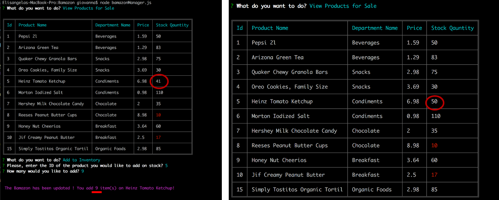
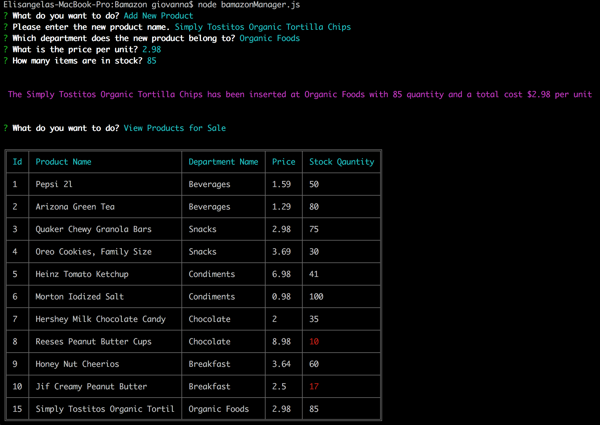

# Bamazon

Bamazon is an Amazon-like command line with is created with Node.js and MySQL.
This application has two different functionalities:

* Customer
* Manager 

## Customer 
The Customer functionality takes the customer order and deplete stock from the store's inventory.

The app will ask the customer what they would like to purchase by the item ID and the quantity. Then, the total cost will be displayed.

## Manager 
The Manager functionality is presented with four options:
1. View Products for Sale
* Displays a list of all products for sale.
2. View Low Inventory
* Displays a list of products with 5 or less items left in inventory.
3. Add to Inventory
* Allows the user to add more inventory to an already existing item.
4. Add New Product
* Allows the user to add a completely new product to the database.

#### This demo shows the Bamazon products and the Low inventory 

#### Add more product on inventory 

### Add a new product 

## NPM Packages 
* [MySQL](https://www.npmjs.com/package/mysql)
* [Inquirer](https://www.npmjs.com/package/inquirer)
* [Colors](https://www.npmjs.com/package/colors)
* [Cli Table](https://www.npmjs.com/package/cli-table)